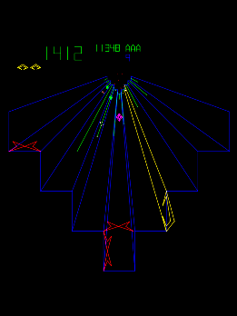
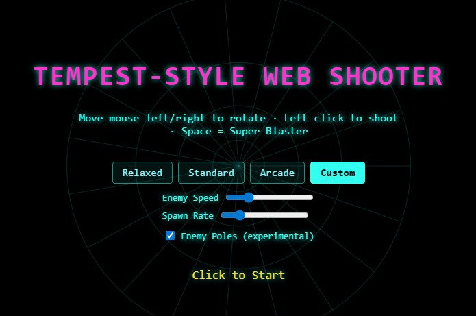
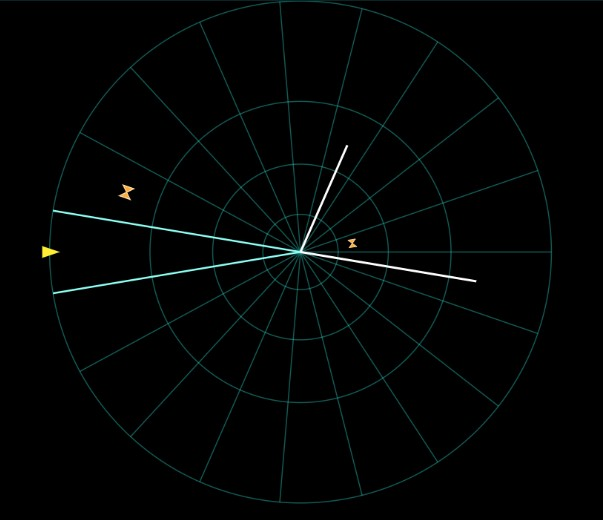

# Tempest-Style Web Shooter

Standalone HTML/CSS/JavaScript arcade game inspired by Tempest (1981). No backend, no build step, no dependencies. Player sits on the rim of a tube, shoots inward at enemies crawling out from the center, and has a limited-use Super Blaster panic button.

 

## How to Run

Open `tempest-web/index.html` directly in Microsoft Edge, or serve the `tempest-web/` folder with any static file server (recommended for consistent ES module loading in some setups), e.g. the VS Code "Live Server" / Live Preview extension pointed at `index.html`.

No install step, no Python, no build tooling required.

## Controls

- **Move:** Mouse left/right (glides around the tube's rim; wraps at the ends on Circle/Box, clamps at both ends on U/W/Line)
- **Shoot:** Hold left mouse button (fires repeatedly, capped by cooldown)
- **Super Blaster:** Space bar (clears enemies, enemy projectiles, and poles; limited charges, refills each level)
- **Pause:** P (freezes the game; Esc resumes)
- **Click** on the title/game-over screen starts/restarts a run

The game requests Pointer Lock when playing so mouse rotation is unbounded (not clamped at your monitor's edge). Pressing Escape releases the pointer lock as a side effect of the browser exiting it (in addition to resuming from pause); click the canvas again to re-acquire it.

## Difficulty Profiles

Choose on the title screen:
- **Relaxed** — slower/sparser enemies, more lives-saving forgiveness, jumper/shooter enemies unlock later
- **Standard** — baseline pacing
- **Arcade** — fast, dense, unforgiving, all enemy types from level 1
- **Custom** — Standard baseline with sliders for enemy speed and spawn rate; picking a preset first and then Custom seeds the sliders from that preset

Your last-selected profile and Custom slider values persist across reloads via `localStorage`.

## Arena Shapes

Choose the tube's cross-section on the title screen, next to the difficulty selector:
- **Circle** / **Box** — closed loops; movement wraps around continuously
- **U** / **W** / **Line** — open paths; movement clamps at both ends instead of wrapping

The selection applies to the whole run (all levels use the same shape) and persists across reloads via `localStorage`, defaulting to Circle.

## Progression

Levels clear by hitting a kill quota (grows each level). Clearing a level awards a score bonus, refills Super Blaster charges, and ramps enemy speed/spawn rate further (governed by the active profile's per-level increments and hard caps).

## Enemy Poles (experimental)

A toggle on the title screen ("Enemy Poles"), **off by default**. When enabled, starting at level 2 a white line can grow up a random lane:

- It grows steadily toward the rim and caps there — it doesn't disappear on its own once fully grown, it just sits there.
- Any enemy within the pole's current length is shielded: your shots pass it by until it climbs past the pole's tip.
- Shooting into an occupied lane hits the pole first, shrinking it a bit each time; enough hits destroy it.
- The Super Blaster also destroys all active poles (along with enemies and enemy shots).

## Config

- `tempest-web/js/config.js` — core tuning constants (speeds, cooldowns, timings, scoring, poles) — see the table below
- `tempest-web/js/difficultyProfiles.js` — the four difficulty profiles and their per-profile scaling/caps/unlock levels
- `tempest-web/js/arenaShapes.js` — the five arena shapes' rim path data
- `tempest-web/js/arena.js` — compiles a shape into evenly arc-length-spaced lane centers/boundaries

## Known Limitations

- Mute (M) is stubbed but not wired to input — `tempest-web/js/audio.js`'s sound hooks are silent no-ops (called at the right moments, ready for real sound assets).
- No gamepad support.

## Browser Tested

Microsoft Edge (Chromium) on Windows 11.

## Gameplay Variables Reference

All constants below live in `tempest-web/js/config.js` unless noted otherwise. Edit a value, reload, and the change takes effect immediately — no build step.

| Variable | Value | Meaning |
|---|---|---|
| `GAME_WIDTH` | 1280 | Canvas width (px) |
| `GAME_HEIGHT` | 720 | Canvas height (px) |
| `FIXED_TIMESTEP_MS` | 1000/60 (~16.67) | Simulation step duration (ms) |
| `LANE_COUNT` | 16 | Number of lanes around the tube |
| `RIM_RADIUS` | 360 | Logical gameplay depth scale (0 = center, this = rim). Rendering has its own independent screen-space scale in `renderer.js` |
| `START_LIVES` | 3 | Starting lives |
| `START_BLASTER_CHARGES` | 3 | Fallback blaster-charge display before a run starts (the real starting value per run comes from the profile's `blasterChargeStart`) |
| `MOUSE_SENSITIVITY` | 0.75 | Mouse delta multiplier applied before lane-step thresholding |
| `LANE_STEP_THRESHOLD` | 45 | Raw mouse px needed per lane step, before a profile's `laneStepSensitivityScale` |
| `MAX_LANE_STEPS_PER_FRAME` | 2 | Caps how many lanes a single frame's mouse swipe can move |
| `PLAYER_FIRE_COOLDOWN_MS` | 220 | Base cooldown between player shots, before a profile's `playerFireCooldownScale` |
| `PLAYER_PROJECTILE_SPEED` | 900 | Player shot travel speed (depth units/sec) |
| `ENEMY_PROJECTILE_SPEED` | 420 | Enemy shot travel speed (depth units/sec) |
| `ENEMY_BASE_SPEED` | 140 | Base enemy crawl speed (depth units/sec), before per-type/profile/level multipliers |
| `ENEMY_SPAWN_INTERVAL_MS` | 1400 | Base time between enemy spawns, before profile/level scaling |
| `JUMPER_JUMP_INTERVAL_MS` | 900 | Time between a jumper's lane switches |
| `SHOOTER_FIRE_INTERVAL_MS` | 1600 | Base time between a shooter's shots, before a profile's fire-rate scaling |
| `PLAYER_DEATH_DURATION_MS` | 1000 | Pause length after player death before respawn |
| `HIT_DEPTH_TOLERANCE` | 18 | Depth-overlap window for a player shot to register as hitting an enemy |
| `BLASTER_FLASH_DURATION_MS` | 300 | Screen-flash duration on Super Blaster use |
| `BLASTER_INVULN_MS` | 300 | Brief invulnerability granted after using the blaster |
| `LEVEL_CLEAR_DURATION_MS` | 1500 | Pause length on level clear before the next level starts |
| `LEVEL_KILL_QUOTA_BASE` | 10 | Kills needed to clear level 1 |
| `LEVEL_KILL_QUOTA_PER_LEVEL` | 4 | Extra kills required per additional level |
| `LEVEL_CLEAR_BONUS_PER_LEVEL` | 500 | Score bonus per level number on clear (bonus = this × level) |
| `SCORE_BY_ENEMY_TYPE` | crawler 100 / jumper 200 / shooter 300 | Points awarded per enemy type killed |
| `POLE_MIN_LEVEL` | 2 | First level poles can start appearing (Enemy Poles toggle only) |
| `MAX_SIMULTANEOUS_POLES` | 2 | Cap on concurrently active poles |
| `POLE_SPAWN_INTERVAL_MS` | 6000 | Time between pole spawn attempts |
| `POLE_GROWTH_RATE` | 45 | Pole growth speed (depth units/sec) |
| `POLE_SHRINK_PER_HIT` | 90 | Pole length removed per player shot that hits it |

### Difficulty profile fields (`tempest-web/js/difficultyProfiles.js`)

Each of Relaxed/Standard/Arcade/Custom defines all of these; only the four listed above under Config are shared globally.

| Field | Meaning |
|---|---|
| `enemySpeedScale` | Multiplier on `ENEMY_BASE_SPEED` at level 1 |
| `spawnRateScale` | Multiplier on `ENEMY_SPAWN_INTERVAL_MS` at level 1 (higher = faster spawns) |
| `enemyProjectileChanceScale` | Multiplier on shooter fire rate (higher = more frequent shots) |
| `maxSimultaneousEnemies` | Cap on concurrently active enemies |
| `blasterChargeStart` | Starting Super Blaster charges for a run |
| `playerFireCooldownScale` | Multiplier on `PLAYER_FIRE_COOLDOWN_MS` |
| `respawnInvulnerabilityMs` | Invulnerability duration after respawning |
| `laneStepSensitivityScale` | Multiplier on mouse sensitivity (higher = easier to turn) |
| `aimAssistWindowMs` | Forgiveness window widening the hit-detection tolerance |
| `perLevelSpeedIncrement` | Added to `enemySpeedScale` per level beyond 1 |
| `perLevelSpawnIncrement` | Added to `spawnRateScale` per level beyond 1 |
| `minSpawnIntervalMs` | Hard floor on spawn interval regardless of level scaling |
| `maxEnemySpeed` | Hard cap on enemy speed regardless of level scaling |
| `maxEnemyProjectiles` | Cap on concurrently active enemy projectiles |
| `jumperUnlockLevel` | First level jumpers can spawn |
| `shooterUnlockLevel` | First level shooters can spawn |
